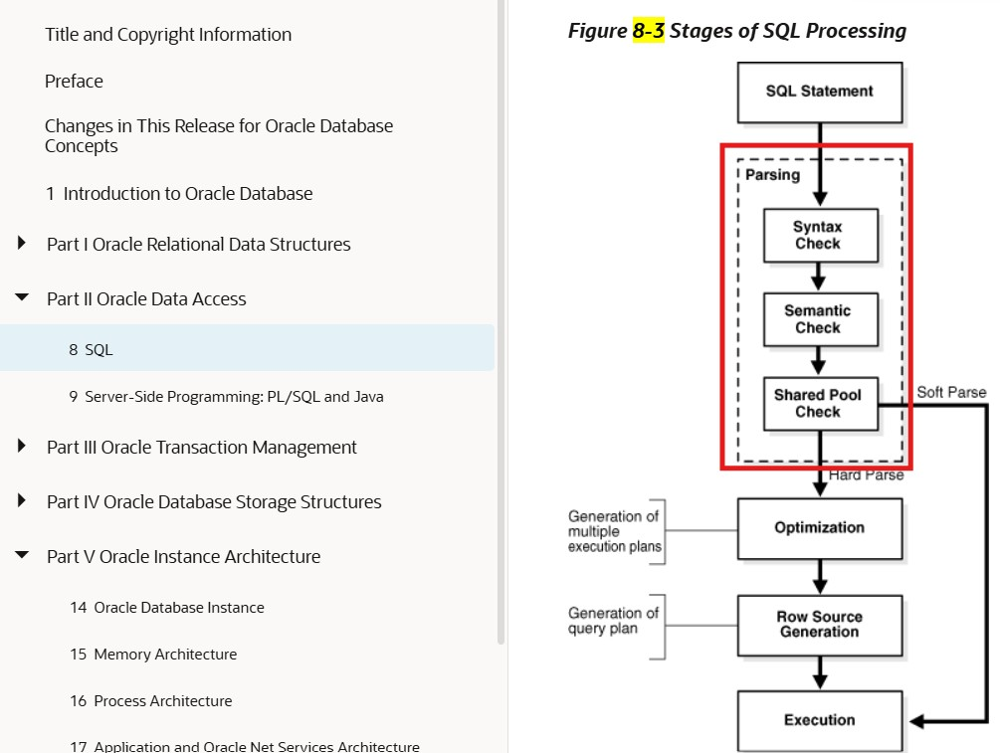
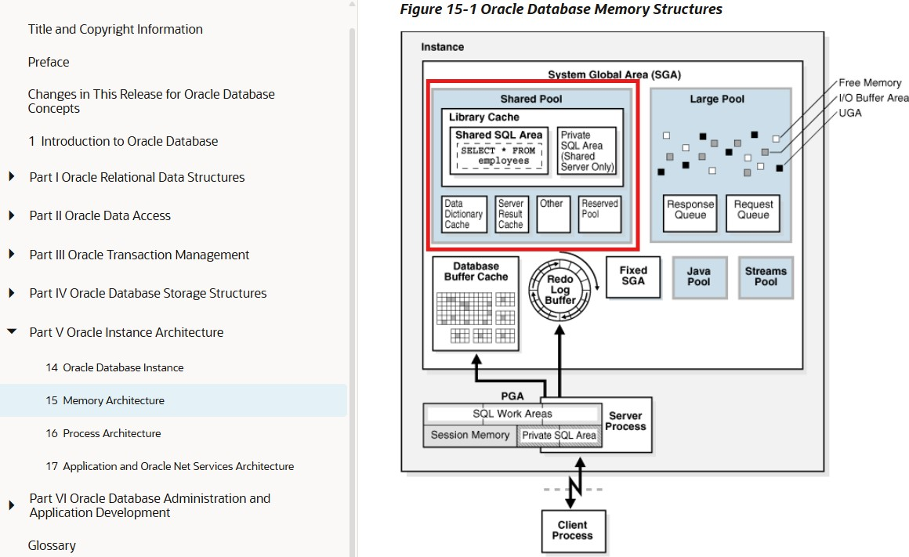

## 260910tue
### DDL(Data Definition Language)
1. CREATE
2. ALTER
3. DROP
4. RENAME
5. TRUNCATE
6. COMMENT
</br></br></br>
```SQL
SELECT *
FROM v$reserved_words
WHERE reserved = 'Y'; /*  객체명/식별자로 사용이 제한되는 예약어 조회 */
```
|KEYWORD|RESERVED|. . .|
:---|:---|---|
DROP|Y|. . .|
FOR|Y|. . .|
OF|Y|. . .|
IS|Y|. . .|
VARCHAR|Y|. . .|
. . .|Y|. . .|

</br></br></br>
```SQL
--CREATE USER 고유한 유저명 /* 유저 생성시 필수 구문 */
--IDENTIFIED BY PW /* 유저 생성시 필수 구문 */
--DEFAULT TABLESPACE 테이블 스페이스명
--TEMPORARY TABLESPACE 임시 테이블 스페이스명 /* SORT, HASH 작업시에, 메모리가 아닌 디스크에서 작업하는 공간 */
--QUOTA 용량(K, M) /* 테이블 스페이스를 사용할 권한 부여 */
--ON 테이블 스페이스명
--ACCOUNT UNLOCK;
```
> CREATE 예시
```SQL
CREATE USER insa
IDENTIFIED BY insa
DEFAULT TABLESPACE users
TEMPORARY TABLESPACE temp
QUOTA 1M ON users;
```
> 신규 유저 생성 예제 코드

</br></br></br>
```SQL
ALTER USER insa /* ' CREATE ' 문구만 ' ALTER ' 변경 */
QUOTA UNLIMITED
ON users;
```
> 유저 테이블 스페이스 사용량 무한으로 변경 예제 코드
- 유저명은 수정 불가 ( 필요시 삭제후, 재생성 )
</br></br></br>
```SQL
DROP USER insa CASCADE;
```
> CASCADE : 유저가 생성했던 객체들을 우선으로 삭제하는 옵션
---
</br></br></br>


```SQL
CREATE TABLE insa.EMP(id NUMBER, name VARCHAR2(30), day DATE DEFAULT SYSDATE)
TABLESPACE users; /* 실무에서는 TABLESPACE 필히 작성해 주는게 좋다 (생략시, 사용자의 DEFAULT TABLESPACE 위치에 생성) */
```
> TABLE 생성 예제 코드

</br></br></br>
```SQL
DROP TABLE insa.emp PURGE;
```
> TABLE 삭제 예제 코드
---
</br></br></br>


###
```SQL
--USER_ → 내가 소유한 것
--ALL_  → 내가 접근할 수 있는 것
--DBA_  → DB 전체


--USER_TABLES → 내가 소유한 테이블
--ALL_TABLES  → 내가 접근 가능한 테이블
--DBA_TABLES  → DB 전체 테이블
```
> 예시
- ' SYS.TAB$ ' 같이 $로 끝나는 객체는, 내부 구현에 사용하는 테이블로서 일반적인 SQL 개발에서는 직접 조회하기보단 공식 Data Dictionary View 사용 권장
```SQL
SELECT *
FROM USER_USERS; /* 현재 접속한 사용자(본인)의 정보 */


SELECT *
FROM DBA_USERS; /* DB 전체 사용자 정보 ( DBA 권한 또는 해당 데이터 딕셔너리 뷰를 조회할 수 있는 권한 필요 )*/
```
```SQL
SELECT *
FROM SYS.TAB$; /* Oracle 내부 데이터 딕셔너리 테이블 ( 내부 구현에 사용하는 테이블로서, 일반적인 SQL 개발에서는 직접 조회하기보다 공식 Data Dictionary View 사용 권장 ) */


SELECT *
FROM USER_TABLES; /* 현재 접속한 사용자가(본인) 소유한 테이블 정보 */


SELECT *
FROM DBA_TABLES; /* 테이블 정보용 공식 Dictionary View ( DB 전체의 테이블을 확인할 수 있는 권한 필요 ) */
```
```SQL
SELECT *
FROM SYS.COL$; /* Oracle 내부 데이터 딕셔너리 테이블 ( 데이터베이스 객체의 컬럼(열) 관련 내부 정보를 저장 ) */


SELECT *
FROM USER_TAB_COLUMNS; /* 내가 소유한 테이블의 컬럼 */
```
```SQL
SELECT *
FROM DBA_DATA_FILES; /* Oracle 내부 데이터 딕셔너리 테이블 (TABLESPACE 자체를 조회하는 것이라기보다는, TABLESPACE가 사용하는 물리적인 DATAFILE을 조회) */ /* DB 데이터 파일 조회 ( 어떤 TABLESPACE가, 어떤 DATAFILE을 사용하는지 확인 ) */


SELECT *
FROM DBA_TEMP_FILES; /* 임시 테이블 스페이스 조회 */


SELECT *
FROM DBA_TS_QUOTAS; /* DB 전체 사용자의, TABLESPACE QUOTA 조회 ( QUOTA 부여한 유저 정보 조회 ) */


SELECT *
FROM USER_TS_QUOTAS; /* 현재 접속한 사용자의(본인) TABLESPACE QUOTA 조회 */
```
- ' SELECT * FROM DBA_DATA_FILES; ' == 영구 TABLESPACE의 데이터 파일(Datafile) 정보 조회 ( 파일 경로, 크기, 자동 확장 여부, 어느 TABLESPACE에 속하는지 등 )
  - ' SELECT * FROM DBA_DATA_FILES; ' 결과중, ' TABLESPACE_NAME ' == 'SYSTEM', 'SYSAUX', 'UNDOTBS1' 항목은, 일반 유저가 사용 금지
- ' SELECT * FROM DBA_TS_QUOTAS; ' 결과중, ' MAX_BYTES ' == ' -1 ' 의미는 무한 ( -1 == 용량 제한 없다는 의미 )
---
</br></br></br>

### 서버 프로세스 (Server Process)

1. User Process, SQL 문장을 던진다
2. Server Process, CURSOR 메모리 할당받고
3. User Process 던져준 SQL 문장을 받아서, 이미지상의 ' Parsing ' 작업
- Syntax Check : 문법 체크
- Semantic Check : 의미 분석 체크 ( 오브젝트가 테이블이라면, 테이블 컬럼 체크 )
  - ```SQL
    SELECT *
    FROM SYS.USER$ /* Oracle 내부 데이터 딕셔너리 테이블 ( 직접 INSERT / UPDATE / DELETE / 구조 변경은 하지 않는 것이 원칙 ) */
    WHERE USERNAME = 'HR' /* ' HR ' 유저가 존재하는지 체크 */


    SELECT *
    FROM SYS.OBJ$ /* 내부적으로, 객체 체크시 활용 */
    WHERE OWNER = 'HR' AND OBJECT_NAME = 'EMPLOYEES'; /* ' HR ' 소유한, 'EMPLOYEES ' 객체 정보 조회 */


    SELECT *
    FROM DBA_TABLES /* Oracle 내부 데이터 딕셔너리 테이블 ( 객체 타입이 테이블일 경우, 테이블 스페이스 체크 ) */
    WHERE OWNER = 'HR' AND TABLE_NAME = 'EMPLOYEES'; /* ' HR ' 소유한 테이블 정보 조회 */


    SELECT *
    FROM DBA_TAB_COLUMNS
    WHERE OWNER = 'HR' AND TABLE_NAME = 'EMPLOYEES'; /* 컬럼 체크 */
    ```
---
</br></br></br>


### Shared Pool

- Data dictionary Cache : Semantic Check 시도할 때마다, 디스크 I/O 발생을 줄이기 위해서 딕셔너리 정보를 메모리에 올려놓은 공간
---
